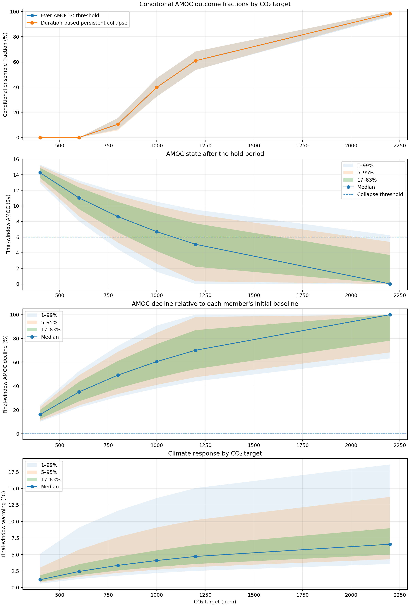
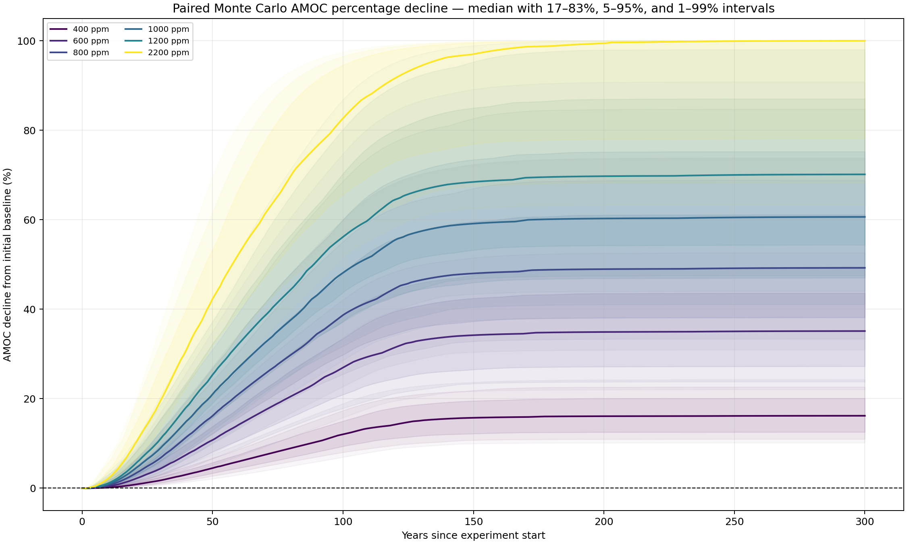
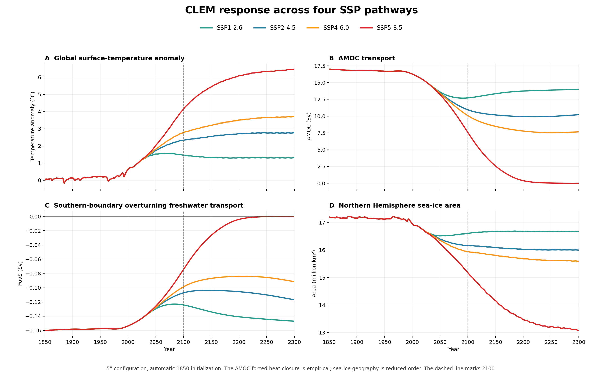
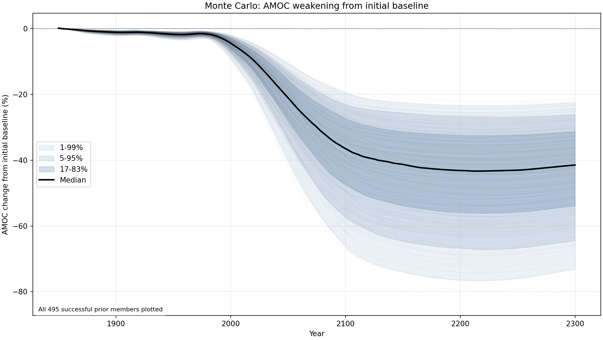
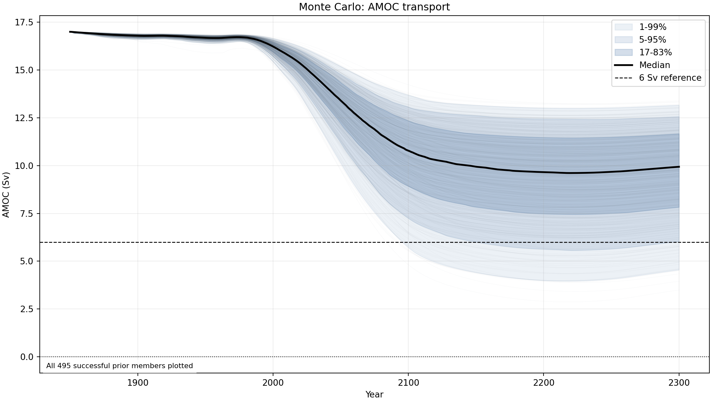
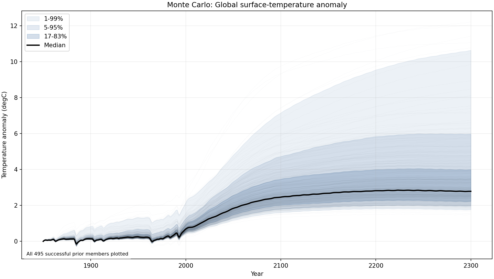
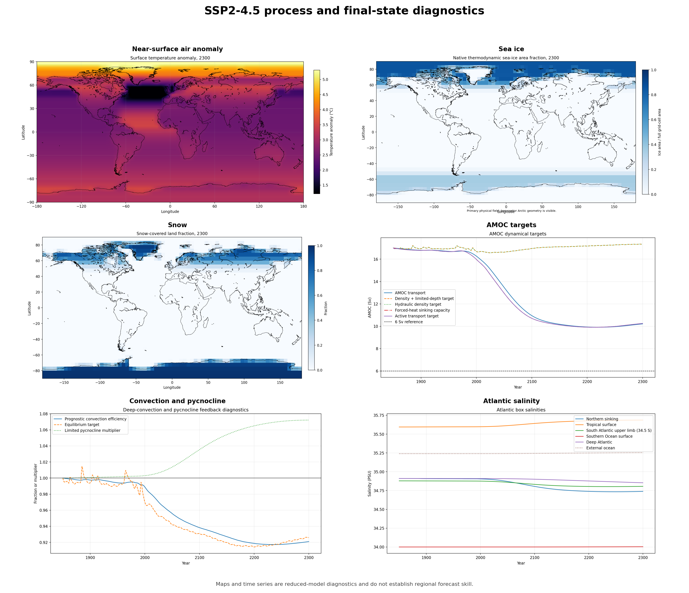
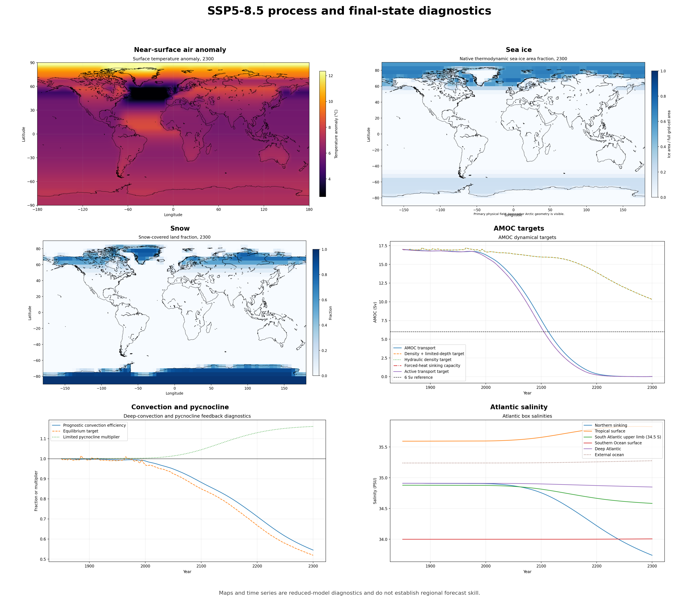

# Coupled Low-complexity Earth Model v2.29.29

**Abbreviation: CLEM**  
**Current release: v2.29.29**  

**CLEM v2.29.29** is a process-based reduced-complexity climate model written in Python.

It couples global temperature, ocean heat uptake, radiative feedbacks, Arctic sea ice, Greenland meltwater, Atlantic salinity, and a dynamically evolving Atlantic Meridional Overturning Circulation (AMOC).

CLEM is intended for **climate-process experiments, sensitivity studies, teaching, and model development** rather than as a replacement for a comprehensive General Circulation Model (GCM) or Earth System Model (ESM).

Climate sensitivity is not prescribed directly. **ECS and TCR are diagnosed from forcing experiments.** The original feedback coefficients were calibrated against AR6 assessments. This is calibration evidence, not independent validation.

## Current scientific results

The current checkout adds a FAFMIP-informed AMOC sinking-capacity limit. The
lower of this limit and the hydraulic density capacity controls the default SSP
response. Its global-forcing mapping and 20-year lag are emulator assumptions,
so these results are conditional sensitivities. See the
[forced-heat review](docs/AMOC_FORCED_HEAT_CLOSURE_2026_09_14.md).

### Weighted CO2 target sweep

This larger posterior weighted assessment supersedes the earlier 128 member
sweep for its central estimates. It requested 512 paired Monte Carlo members
for each of eight fixed targets at 280, 400, 600, 700, 800, 1000, 1200 and
1600 ppm. The supplied run log records a Sobol design, triangular sampling,
science priors and AR6 AMOC constraint mode. A total of 495 paired members
completed every target, giving a 96.68% survival fraction.

| Target | Weighted persistent collapse | Weighted mean peak decline | Weighted median peak decline | Weighted P05 to P95 | Member minimum to maximum |
|---|---:|---:|---:|---:|---:|
| 280 ppm | 0.000% | 0.439% | 0.277% | 0.170% to 1.902% | 0.164% to 3.738% |
| 400 ppm | 0.000% | 14.775% | 13.838% | 10.287% to 20.487% | 9.908% to 25.674% |
| 600 ppm | 0.000% | 32.055% | 30.023% | 22.319% to 44.447% | 21.496% to 55.700% |
| 700 ppm | 0.166% | 38.895% | 36.429% | 27.081% to 53.930% | 26.082% to 67.585% |
| 800 ppm | 3.412% | 44.951% | 42.102% | 31.298% to 62.328% | 30.144% to 78.109% |
| 1000 ppm | 23.049% | 55.337% | 51.829% | 38.530% to 76.728% | 37.108% to 100.000% |
| 1200 ppm | 40.829% | 63.957% | 59.956% | 44.572% to 88.761% | 42.927% to 100.000% |
| 1600 ppm | 75.952% | 76.796% | 72.781% | 54.106% to 100.000% | 52.110% to 100.000% |





Collapse requires AMOC below 6 Sv for at least 95% of the final 30 year window
and no active recovery longer than 5 years. Peak decline is the largest percent
reduction from each member specific preforcing AMOC baseline. The mean, median
and P05 to P95 columns use posterior weights. Member minimum to maximum gives
the observed raw extrema across the 495 completed members. Values are rounded
to three decimal percentage points.

The weighted central assessment shows steadily stronger AMOC decline as the
target rises. Persistent collapse is absent through 600 ppm, appears at 700
ppm, reaches 23.049% at 1000 ppm and 75.952% at 1600 ppm. The weighted
threshold fit reaches 10% persistent collapse near 867 ppm and 50% near 1304
ppm, conditional on this model and its priors.

Posterior weighting makes the central estimates more informative than the
earlier unweighted sweep, but the run reports an effective sample size of 28.6,
below its required 49.5. Its quantitative uncertainty products are therefore
labelled exploratory only. The weighted intervals and threshold values should
be read as conditional screening results rather than precise probability bounds.

### Four-pathway SSP comparison

All four panels use the same 5° integrations from 1850 to 2300.



| Scenario | 2100 temperature | AMOC, 2081–2100 | AMOC decline | 2100 FovS | 2100 sea ice |
|---|---:|---:|---:|---:|---:|
| SSP1-2.6 | 1.46 °C | 12.70 Sv | 20.9% | −0.124 Sv | 16.61 million km² |
| SSP2-4.5 | 2.33 °C | 11.30 Sv | 29.7% | −0.107 Sv | 16.17 million km² |
| SSP4-6.0 | 2.77 °C | 10.63 Sv | 33.8% | −0.099 Sv | 15.95 million km² |
| SSP5-8.5 | 4.14 °C | 8.79 Sv | 45.3% | −0.075 Sv | 15.18 million km² |

Temperature is relative to 1850. AMOC decline compares 2081–2100 with
1995–2014. Under SSP5-8.5 the empirical branch approaches zero by 2300.

### SSP2-4.5 parameter uncertainty



| Absolute AMOC transport | Global surface-temperature anomaly |
|:---:|:---:|
|  |  |

### Current biases and scope

| Check | Current result | Reference or declared range | Difference |
|---|---:|---:|---:|
| Historical warming, 2011–2020 | 0.8368 °C | 0.95–1.20 °C | 0.1132 °C below lower bound |
| Ocean heat-content change, 1971–2018 | 348.2 ZJ | 350–500 ZJ | 1.8 ZJ below lower bound |
| 100-year post-hosing recovery | 79.510% | at least 80% | 0.490 percentage points low |
| Historical AMOC, approximately 2004–2020 | 15.74–15.86 Sv | RAPID 16.9 ± 1.2 Sv | about 1.0–1.2 Sv low |
| Arctic sea-ice area bias | March +0.355 and September −0.055 million km² | NSIDC-compatible area | seasonal signed bias |

AMOC spread mainly reflects the forced-heat prior. FovS remains prognostic but
follows the AMOC closure while it controls. The sea-ice maps use reduced
geometry and have no local forecast skill.

### SSP diagnostics

The composites show surface temperature, sea ice, snow, AMOC, convection,
pycnocline depth and Atlantic salinity. The rectangular North Atlantic feature
comes from the reduced grid.

#### SSP2-4.5



#### SSP5-8.5



Figure provenance and source hashes are in the
[asset manifest](docs/assets/science_update_2026_09/manifest.json).

## Current release status

The current science update uses direct water mass TEOS-10 density, an open
Atlantic boundary, updated Greenland and Arctic feedbacks, and the
FAFMIP-informed AMOC sinking capacity. The figures above use this unreleased
revision. Detailed release history and inherited evidence are recorded in the
[release notes](RELEASE_NOTES_V2_29_29.md),
[dynamics equivalence record](V2_29_29_DYNAMICS_EQUIVALENCE.json), and
[physics repair report](docs/PHYSICS_REVIEW_REPAIRS_2026_09_12.md).

The Arctic observational stack contains six development and structural
diagnostics. Independent prospective validation is not yet available because
the preregistered 2027 to 2036 observation period is still in the future.

---

## Features

### Global Climate

- Latitude-band energy-balance climate model
- Separate land, mixed-layer ocean, and deep-ocean heat reservoirs
- Meridional heat transport
- Land-ocean heat exchange
- Annual-mean insolation in the latitude-band energy-balance model
- Prognostic low-cloud feedback
- Snow and surface-albedo feedbacks
- Water-vapour feedback
- Lapse-rate feedback
- Deep-ocean heat uptake
- CO2 forcing using the Meinshausen et al. formulation
- SSP1-2.6
- SSP2-4.5
- SSP4-6.0
- SSP5-8.5
- Abrupt 2xCO2 experiments
- 1% CO2 experiments
- Ramp-and-hold forcing
- Overshoot experiments
- Constant-CO2 experiments
- Hybrid SSP experiments

### Arctic and Cryosphere

- Seasonal thermodynamic Arctic model
- Seasonal solar geometry, including polar night and midnight sun, within the Arctic module
- Prognostic sea-ice concentration
- Prognostic sea-ice volume
- Vertical ice growth
- Lateral melt
- New-ice formation
- Ridging
- Divergence
- Mechanical sea-ice export
- Separate Atlantic and non-Atlantic Arctic sectors
- Snow and ice albedo
- Melt-pond effects
- Ocean-atmosphere heat exchange
- Sea-ice freshwater storage
- Sea-ice freshwater export
- Greenland surface-mass-balance response
- Positive-degree-day Greenland melt
- Greenland precipitation and retention
- Greenland freshwater delivery to the North Atlantic

### AMOC and Atlantic Ocean

CLEM contains an explicitly coupled reduced-order AMOC. Its transport evolves
toward the lower of a prognostic hydraulic density capacity and an empirical,
slow forced-heat capacity benchmarked against FAFMIP experiments. FAFMIP does
not directly constrain CLEM's global-forcing-to-regional-heat mapping.

The AMOC subsystem includes:

- Five active Atlantic boxes
- External ocean salt reservoir
- Northern Atlantic box
- Tropical Atlantic box
- South Atlantic upper box
- Southern Ocean box
- Deep Atlantic reservoir
- Prognostic temperature-driven density changes
- Prognostic salinity-driven density changes
- Dynamic pycnocline depth
- Ekman inflow
- Eddy outflow
- Low-latitude upwelling
- Continuous deep-convection response
- Gyre salt exchange
- Hydrological freshwater forcing
- Greenland freshwater forcing
- Arctic sea-ice freshwater forcing
- AMOC heat transport feedback
- FAFMIP-informed empirical forced-heat sinking capacity
- Salt-advection feedback
- Freshwater hosing experiments
- Weak and collapsed AMOC states
- AMOC recovery experiments
- Equilibrium continuation
- Hysteresis diagnostics

Negative/reversed AMOC is disabled in the validated default configuration because a reverse-circulation closure has not been independently validated.

---

## Climate Sensitivity

CLEM calculates its climate sensitivity from explicit forcing experiments rather than specifying ECS as a fixed input.

| Diagnostic | CLEM v2.29.29 |
|---|---:|
| Equilibrium Climate Sensitivity (ECS) | **3.273 °C** |
| Gregory effective ECS, years 1-150 | **3.461 °C** |
| Transient Climate Response (TCR) | **1.923 °C** |
| 2xCO2 effective radiative forcing | **3.93 W m^-2** |
| Net climate feedback | **-1.144 W m^-2 K^-1** |
| Planck feedback | **-3.255 W m^-2 K^-1** |
| Water-vapour feedback | **+1.814 W m^-2 K^-1** |
| Resolved lapse-rate feedback | **-0.465 W m^-2 K^-1** |
| Water-vapour + lapse-rate | **+1.384 W m^-2 K^-1** |
| Surface-albedo feedback | **+0.302 W m^-2 K^-1** |
| Cloud feedback | **+0.425 W m^-2 K^-1** |

These inherited sensitivity values used the bulk-surface temperature field.
Current ECS, TCR, Gregory regression, and feedback normalization use
`global_near_surface_air_warming_c`. Outputs identify that field explicitly and
retain separate `bulk_surface_equilibrium_response_c` and
`bulk_surface_transient_response_c` diagnostics. The two temperature definitions
must not be treated as interchangeable in comparisons or calibration.

The equilibrium 2xCO2 experiment reaches approximately **3.27 °C warming** while retaining an AMOC strength of approximately **11.1 Sv**.

---

## AMOC and Salt-Advection Feedback

The default control configuration uses an AMOC reference strength of approximately:

**17 Sv**

### FovS

CLEM uses the conventional sign interpretation in which negative FovS represents an overturning circulation that exports freshwater from the Atlantic.

In the revised model, `fovs_sv` and `amoc_boundary_overturning_freshwater_sv`
both report the actual external boundary transport. The historical SAU/deep
quantity is retained as `amoc_internal_section_freshwater_sv`.

The default control salinity contrast is solved without an FovS target. The
specified control budget contains -0.28 Sv of Atlantic surface freshwater
exchange, +0.06 Sv of northern-boundary import, and +0.38 Sv of azonal southern
gyre import. Steady conservation then predicts:

**FovS = -0.16 Sv**

This is an equilibrium budget prediction conditional on independently estimated
control fluxes. CLEM does not yet predict absolute evaporation, precipitation,
runoff, or the azonal boundary transport, so it is not a free coupled-climate
prediction. `amoc_basin_salt_inventory_anomaly_psu_m3` tracks subsequent basin
storage changes.

In the current 5° SSP2-4.5 batch, external-boundary FovS remains negative
through 2100.

| Period | FovS |
|---|---:|
| 2081–2100 mean | **−0.10991 Sv** |
| 2100 | **−0.10725 Sv** |

Salt is explicitly conserved between the Atlantic and compensation reservoirs.

The validation integrations report a maximum salt-conservation error of:

**0.0 ppm to reported numerical precision**

---

## SSP2-4.5 Example

The SSP2-4.5 experiment produces similar global warming at 5° and 10° model resolution.

The current default uses the FAFMIP-informed forced-heat sinking-capacity proxy
described in the [September 14 forced-heat report](docs/AMOC_FORCED_HEAT_CLOSURE_2026_09_14.md).

| Current unreleased metric | 5° | 10° |
|---|---:|---:|
| AMOC, 1995–2014 | 16.083 Sv | 16.083 Sv |
| AMOC, 2081–2100 | **11.297 Sv** | **11.297 Sv** |
| AMOC decline | **29.761%** | **29.761%** |
| AMOC in 2100 | 10.952 Sv | 10.952 Sv |
| Late-century FovS | −0.1099 Sv | −0.1100 Sv |
| FovS in 2100 | −0.10725 Sv | −0.10732 Sv |
| Hydraulic target in 2100 | 16.957 Sv | 16.844 Sv |
| Forced-heat capacity in 2100 | 10.710 Sv | 10.710 Sv |

The forcing-index heat capacity is the tighter limit in this SSP run, which is
why the AMOC trajectory is common across resolutions. The grid-dependent
hydraulic targets and prognostic FovS values remain distinct. This is reduced
emulator behavior, not evidence that both grids independently predict the same
ocean circulation.

The all-SSP batch shown near the top uses automatic 1850 initialization and
gives a 29.680% SSP2-4.5 decline at 5°. The fixed-control review configuration
in this table gives 29.761%. That small difference is an initialization choice,
not independent cross-resolution agreement. Earlier trial responses are
preserved in the [convection follow-up](docs/CONVECTION_REVIEW_FOLLOWUP_2026_09_14.md)
as development history rather than current results.

---

## Freshwater Hosing Experiments

CLEM supports direct North Atlantic freshwater-forcing experiments for examining AMOC sensitivity, nonlinear weakening, collapse, and recovery.

Example 100-year experiments:

| Freshwater forcing | Final AMOC | North Atlantic temperature response |
|---|---:|---:|
| **0.1 Sv** | **13.78 Sv** | **-0.56 °C** |
| **0.2 Sv** | **9.51 Sv** | **-1.27 °C** |
| **0.3 Sv** | **4.13 Sv** | **-2.17 °C** |

A stronger **0.5 Sv** freshwater experiment reaches the collapsed branch and produces approximately:

**-3.12 °C North Atlantic cooling**

Long hosing and recovery experiments can produce persistent weak or collapsed circulation states rather than forcing the AMOC to automatically return to its initial strength.

---

## Conservation and Numerical Behaviour

CLEM contains explicit diagnostic checks for energy, salt, and ocean-volume consistency.

| Test | Result |
|---|---:|
| Forced energy-budget closure residual | **0.0435%** |
| Maximum reported salt error | **0.0 ppm** |
| Final pycnocline volume imbalance | **5.7 x 10^-7 Sv** |
| 0.05 -> 0.025 yr timestep AMOC difference | **0.0108 Sv** |
| 0.05 -> 0.025 yr timestep GMST difference | **0.00147 °C** |

The validation suite additionally tests:

- Thermal-only AMOC weakening
- Greenland freshwater forcing
- Sea-ice freshwater forcing
- Salt-advection response
- FovS behaviour
- Freshwater hosing
- AMOC collapse
- AMOC recovery
- Pycnocline closure
- Timestep convergence
- Cross-resolution consistency

---

## Arctic Sea Ice

The Arctic subsystem represents sea-ice **area and volume separately**, allowing changes in thickness and concentration to evolve independently.

The corrected R18.2 NSIDC-compatible 15% native-cell **area** comparison for the 5° configuration gives:

| Metric | March | September |
|---|---:|---:|
| Area bias | **+0.355 million km²** | **-0.055 million km²** |
| Area RMSE | **0.451 million km²** | **0.518 million km²** |
| Temporal correlation | **0.872** | **0.900** |
| Model trend | **-0.388 million km² decade^-1** | **-0.830 million km² decade^-1** |
| Observed trend | **-0.380 million km² decade^-1** | **-0.793 million km² decade^-1** |

A literal >=15% threshold applied to CLEM's coarse reconstructed concentration field is **not** treated as a satellite-resolution extent prediction. The separate fractional-support extent diagnostic is retained as a reduced-order structural footprint diagnostic and is non-release-blocking.

R18.4 additionally integrates NSIDC-0611 sea-ice age as a structural diagnostic. Authentic annual source files for **1984–2024** were processed into March/September multiyear-ice fractions with per-file SHA-256 provenance.

---

## Known Biases and Limitations

### Empirical SSP AMOC response

The current SSP AMOC magnitude is set mainly by the FAFMIP-informed empirical
forced-heat capacity. The underlying study applies regional ocean-surface heat
flux perturbations. It does not estimate CLEM's transfer from global effective
forcing, the scaled prior range, or the 20-year response time. Consequently,
the SSP5-8.5 approach toward a near-zero AMOC by 2300 and the Monte Carlo
collapse fraction are emulator sensitivity results. They are not process-only
predictions or calibrated real-world probabilities. FovS remains prognostic,
but its scenario path is conditional on the empirical AMOC transport whenever
that capacity is the active limit.

### Historical AMOC Mean State

The current TEOS-10 density pathway gives a 2004 to 2020 mean AMOC of
15.74 Sv at 10 degrees and 15.86 Sv at 5 degrees, compared with
16.9 plus or minus 1.2 Sv from RAPID. This improves on the former fixed
coefficient pathway without changing the 17 Sv control anchor or applying an
output correction. The comparison is development evidence, not independent
calibration. See [Johns et al. (2023)](https://doi.org/10.1098/rsta.2022.0188).

### Simplified Sea-Ice Geography

CLEM does not contain a high-resolution Arctic ocean grid.

Sea-ice area is therefore more directly represented than geographical sea-ice extent.

Detailed coastlines, regional ice-edge geometry, and small-scale ice transport cannot be reproduced.

### Reduced Atmospheric Dynamics

CLEM does not explicitly simulate:

- Synoptic weather systems
- Atmospheric jets
- Storm tracks
- Clouds as resolved 3-D systems
- Regional precipitation systems
- Atmospheric internal variability comparable to a GCM

These processes are represented through reduced-order parameterizations where relevant.

### Reduced Ocean Dynamics

CLEM does not explicitly resolve:

- Mesoscale ocean eddies
- Complete 3-D ocean circulation
- Detailed western boundary currents
- Regional ocean bathymetry
- Full ocean gyre dynamics
- Eddy-resolving convection

Its AMOC system should therefore be interpreted as a reduced dynamical representation rather than a substitute for an ocean GCM.

### AMOC Tipping Interpretation

CLEM can be used to investigate AMOC stability, collapse, recovery, and hysteresis mechanisms.

It should **not** be used to assign a precise real-world calendar year to a future AMOC tipping event.

---

## Model Purpose

CLEM is primarily intended to investigate questions such as:

- How do radiative feedbacks determine ECS?
- How does deep-ocean heat uptake affect transient warming?
- How does Arctic sea-ice loss affect climate feedbacks?
- How does Greenland meltwater influence North Atlantic salinity?
- How does Arctic freshwater export influence the AMOC?
- How does FovS affect Atlantic salt-advection feedback?
- How strongly does AMOC weaken under SSP forcing?
- How does freshwater forcing alter AMOC stability?
- Can weak or collapsed AMOC states persist after forcing is removed?
- How sensitive are these responses to model resolution and parameter choices?

The goal is not to reproduce every component of a comprehensive Earth System Model.

Instead, CLEM provides a relatively transparent coupled framework in which important climate feedbacks and ocean-circulation mechanisms can be directly inspected, modified, and experimentally tested.

---

## Running CLEM

### Requirements

Python 3.12+ is required.

```bash
python -m venv .venv
```

### Windows

```bash
.venv\Scripts\activate
python -m pip install -r requirements.txt
```

### Linux / macOS

```bash
source .venv/bin/activate
python -m pip install -r requirements.txt
```

---

## Desktop GUI

On Windows:

```bash
run_gui.bat
```

The launcher creates a project-local `.venv` when necessary and synchronizes
all pinned runtime dependencies from `requirements.lock` before opening the
GUI. This includes the production `gsw`/TEOS-10 dependency. Subsequent launches
perform a fast version check and install only when the locked environment is
missing or out of date. An internet connection is therefore required for the
first launch or after a dependency-lock update.

Or run directly:

```bash
python climate_model_gui.py
```

---

## Streamlit Interface

```bash
streamlit run app.py
```

---

## Command Line

Display available options:

```bash
python climate_model.py --help
```

Example SSP2-4.5 experiment:

```bash
python climate_model.py --scenario ssp245 --start-year 1850 --years 250
```

Run all four supported SSP pathways in separate worker processes with identical
settings:

```bash
python climate_model.py --run-all-ssp --ssp-workers 4 --start-year 1850 --years 250 --output outputs_all_ssp
```

This writes the complete normal output set under `ssp126/`, `ssp245/`,
`ssp460/`, and `ssp585/`. At the batch root it also writes four-scenario CSVs
and plots for global near-surface air temperature, AMOC, FovS, and Northern
Hemisphere sea-ice area/extent:

- `ssp_temperature_comparison.csv` and `.png`
- `ssp_amoc_comparison.csv` and `.png`
- `ssp_fovs_comparison.csv` and `.png`
- `ssp_sea_ice_comparison.csv` and `.png`
- `ssp_combined_timeseries.csv`, containing every normal time-series field for
  every scenario in analysis-ready long form

Resume an interrupted batch with the same settings by adding
`--resume-all-ssp`. Complete compatible scenario subfolders are skipped.
Use `--ssp-workers 1` for the former sequential behavior or choose 2–4 workers
to trade additional memory use for faster completion. The default is the
smaller of four workers or the detected logical CPU count.

Available experiment types include:

- Constant CO2
- Linear forcing
- 1% CO2
- Ramp-and-hold
- Overshoot
- Abrupt 2xCO2
- SSP1-2.6
- SSP2-4.5
- SSP4-6.0
- SSP5-8.5
- Hybrid SSP pathways

---

## Validation and evidence

CLEM has physics and structural checks for climate sensitivity, conservation,
numerical convergence, AMOC response, freshwater experiments, sea ice, and
cross resolution behaviour. Detailed results, methods, and historical evidence
belong in the release records rather than the README. See the
[release notes](RELEASE_NOTES_V2_29_29.md),
[dynamics equivalence record](V2_29_29_DYNAMICS_EQUIVALENCE.json), and
[R18.2 results review](docs/internal-repair-history/v2.14-v2.29/R18_2_RESULTS_REVIEW.md).

Release downloads keep the clean source archive separate from historical
numerical evidence. Each asset publishes its own size and SHA 256 value.

---

## Status

CLEM is a **reduced-complexity research and experimentation model**.

Current engineering integrity, numerical verification, physics verification, structural evaluation, and the six-source Arctic observational stack are complete for the frozen v2.29.29 release state. **Independent prospective predictive validation is not yet available** because the preregistered 2027–2036 observation period is in the future.

Results should be interpreted in the context of the model's simplified atmosphere, ocean, and spatial resolution. The model is particularly useful for exploring coupled feedbacks that are difficult to represent in simpler zero-dimensional climate emulators while remaining substantially more transparent and computationally inexpensive than comprehensive Earth System Models.

---

## Third-party data and scientific attribution

Dataset citations, provider acknowledgements, licence notes, and the boundary between CLEM's MIT-licensed code and externally sourced scientific data are documented in [`THIRD_PARTY_DATA.md`](THIRD_PARTY_DATA.md).

Processed third-party scientific data distributed with CLEM retain the attribution and provenance requirements of their source datasets and are not automatically relicensed under CLEM's MIT License.

---

## License

CLEM source code and original CLEM material are released under the MIT License. See `LICENSE`. Third-party datasets and derived data may be subject to separate terms. See `THIRD_PARTY_DATA.md`.
