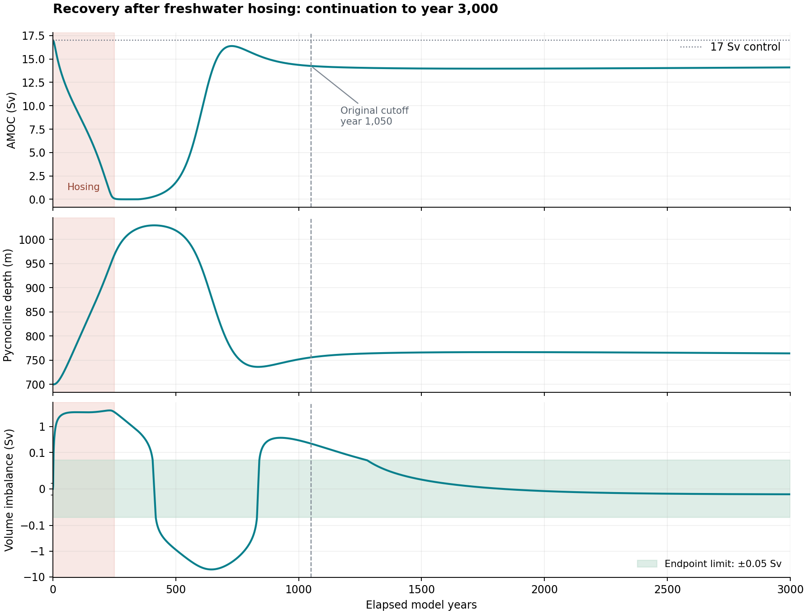

# Recovery extension to year 3,000 — 2026-09-12

The continuation completed at exactly year 3,000 and passes both original
pycnocline closure thresholds. No governing physics or acceptance limits changed.
The completed 1,050-year validation and its failed check remain preserved.

| Diagnostic | Year 1,050 | Year 3,000 | Original limit |
|---|---:|---:|---:|
| Mean absolute volume imbalance from year 600 | 1.63247 Sv | 0.324408 Sv | <0.50 Sv |
| Absolute endpoint volume imbalance | 0.220525 Sv | 0.009408 Sv | <0.05 Sv |
| AMOC | 14.2544 Sv | 14.0980 Sv | — |
| Pycnocline depth | 755.816 m | 764.144 m | — |

The last 450 years have a mean absolute imbalance of 0.009089 Sv, so the
improvement is not solely dilution of the earlier transient in a longer mean.
Over the final 100 years, AMOC changes at +0.013849 Sv per century and depth at
-0.295520 m per century. Residual drift remains; the result establishes passage
of the declared tolerances, not exact mathematical equilibrium.

AMOC recovered substantially after removal of the 0.4 Sv hosing at year 250,
but remains about 17.1% below its 17 Sv control. This trajectory does not support
describing the outcome as persistent near-zero collapse. It also does not meet
the older criterion of returning to within 10% of the control strength. Exact
equilibrium branch identity or uniqueness would require a separate equilibrium
analysis.

Maximum salt error across the combined trajectory is 2.22e-10 ppm; maximum
pre-projection salt error is 5.21e-10 ppm.

## Provenance and execution

The continuation was seeded from the verified year-1,050 checkpoint, preserving
its prognostic state. Only the simulation horizon and the end of the existing
zero-hosing stage were extended. The complete original time series was retained
for the unchanged year-600-onward averaging criterion.

The run was interrupted at year 2,880 and resumed on September 12 from the
intact checkpoint. The final substep also closed a roughly 1e-9-year floating
point endpoint gap, so the worker checkpoint and parent status both explicitly
report completion at year 3,000. Source and final checkpoint hashes were verified.

- Model SHA-256: `bc83e8906ec37b07a47d25649456eee90a1b8e4d877f186233241c1b670db098`
- Extension runner SHA-256: `4eadcbb7d240f6f6d1e05b79df5b61b8446f2208abd993fbc53c6467ea4572b2`
- Original checkpoint SHA-256: `fd09ceaa09a4ca7c1b52b094970f129237a37eed85155efd63609de7558939b7`
- Final checkpoint SHA-256: `71bbfad9178da3364deb43d3aeb504982ab2bc671b84f112a2414c4cd272b18d`
- Results: `physics_recovery_extension_20260911/results.json`
- Lineage: `physics_recovery_extension_20260911/lineage.json`
- Combined trajectory: `physics_recovery_extension_20260911/segments/recovery_0p4_extended_3000y/timeseries.csv`

This resolves the outstanding pycnocline-tolerance failure in the extended
protocol. It does not rewrite the earlier 98/99 result or constitute new
independent observational validation.
